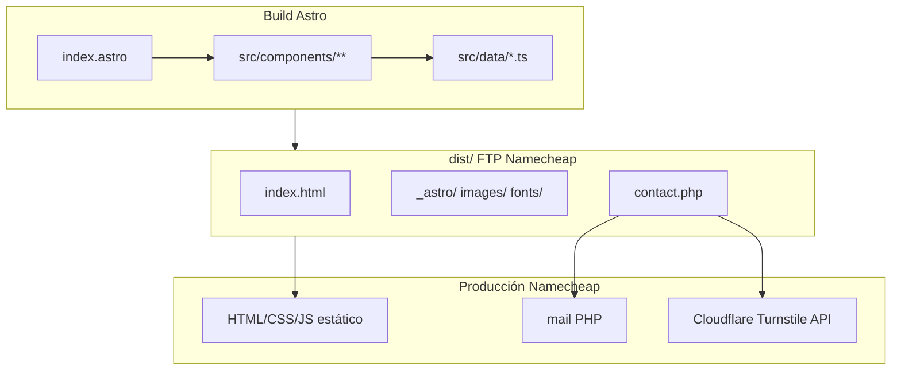
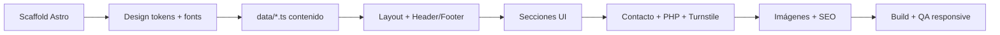

# Plan: Sitio Web Institucional SICSA GROUP

## Contexto actual

El repositorio es **greenfield**: solo existen reglas de Cursor, `CLAUDE.md` y archivos de contenido en [`docs/context/`](docs/context/). No hay `package.json`, `src/`, ni `public/` todavía. La carpeta `docs/assets` mencionada **no existe** en el workspace; los logotipos están disponibles en los assets adjuntos de la conversación y deben copiarse a [`public/images/`](public/images/).

**Decisión por defecto** (preguntas omitidas): **una sola página** (`index.astro`) con navegación por anclas, alineada con “la página debe tener las siguientes secciones”. Se mantiene `404.astro` según el stack.

---

## Arquitectura propuesta



### Estructura de archivos a crear

```
public/
├── images/
│   ├── logo_sicsa.jpg
│   ├── logo_santal.png
│   ├── hero-logistics.webp
│   ├── og-default.jpg
│   └── services/          # imágenes temáticas por servicio
├── fonts/
│   ├── Gilroy-*.woff2     # requiere archivos del cliente
│   └── Montserrat-*.woff2
├── contact.php
├── robots.txt
└── favicon.ico

src/
├── components/
│   ├── layout/
│   │   ├── Header.astro       # dual logo SICSA + SANTAL
│   │   ├── Footer.astro       # redes sociales, contacto, mapa link
│   │   ├── Nav.astro
│   │   ├── MobileMenu.astro
│   │   └── WhatsAppButton.astro
│   ├── sections/
│   │   ├── HeroSection.astro
│   │   ├── RootsSection.astro
│   │   ├── AboutSection.astro      # identidad + herencia
│   │   ├── VisionMissionSection.astro
│   │   ├── ValuesSection.astro
│   │   ├── ServicesSection.astro
│   │   ├── FleetSection.astro      # flota propia (diapositivas)
│   │   ├── StatsSection.astro      # 25 años, 110 empleados, 30+ camiones
│   │   ├── CtaSection.astro
│   │   └── ContactSection.astro    # formulario + mapa + datos
│   └── ui/
│       ├── Button.astro
│       ├── SectionTitle.astro
│       ├── ServiceCard.astro
│       ├── ValueCard.astro
│       ├── SocialLinks.astro
│       └── Badge.astro
├── data/
│   ├── site.ts            # dominio, email, teléfonos, dirección
│   ├── nav-links.ts
│   ├── services.ts
│   ├── values.ts
│   └── company-stats.ts
├── layouts/BaseLayout.astro
├── pages/index.astro
├── pages/404.astro
└── styles/globals.css
```

---

## Design system

### Paleta (extraída de logotipos SICSA + SANTAL)

Definir en [`tailwind.config.mjs`](tailwind.config.mjs):

| Token | Uso | Valor referencia |
|---|---|---|
| `brand-navy` | Textos, header, footer | `#1B2B48` |
| `brand-red` | CTAs, acentos SICSA | `#D12027` |
| `brand-blue` | Acentos SANTAL secundarios | tono medio del logo SANTAL |
| `brand-navy-light` | Fondos alternos | variante 50–100 del navy |

### Tipografía

- **Gilroy** → `font-display` (títulos, hero, CTAs)
- **Montserrat** → `font-sans` (cuerpo, navegación, formularios)
- Cargar vía `@font-face` en [`src/styles/globals.css`](src/styles/globals.css) apuntando a `/public/fonts/`
- **Nota:** Gilroy es fuente comercial. Si el cliente no provee los `.woff2`, usar Montserrat como fallback temporal y documentar en README que deben colocarse los archivos licenciados.

### Layout y UX

- Mobile-first con breakpoints estándar del stack
- Container: `mx-auto max-w-7xl px-4 sm:px-6 lg:px-8`
- Padding secciones: `py-16 sm:py-20 lg:py-24`
- Header sticky con fondo blanco/blur; logos: **SICSA más grande** (izquierda), **SANTAL más pequeño** (junto o separador visual)
- Navegación: Inicio | Nosotros | Servicios | Contacto → anclas `#inicio`, `#nosotros`, `#servicios`, `#contacto`
- Animaciones AOS en cards y secciones (no en hero)
- Botón flotante WhatsApp fijo (esquina inferior derecha) → `https://wa.me/50243905425`

---

## Contenido y redacción

Todo el texto vive en [`src/data/`](src/data/), nunca hardcodeado en componentes. Se unificará y profesionalizará el contenido de:

| Fuente | Uso en el sitio |
|---|---|
| [`docs/context/inicio.md`](docs/context/inicio.md) | Propuesta de valor inicial |
| [`docs/context/nuestras_raices.md`](docs/context/nuestras_raices.md) | Sección “Nuestras raíces” |
| [`docs/context/vision_mision_valores.md`](docs/context/vision_mision_valores.md) | Misión, visión y 6 valores |
| [`docs/context/servicios.md`](docs/context/servicios.md) | 5 bloques de servicios + bullets |
| [`docs/context/contenido_video_institucional.md`](docs/context/contenido_video_institucional.md) | Herencia familiar, 25 años, equipo 110, flota, almacenes |
| [`docs/context/diapositivas_presentacion.md`](docs/context/diapositivas_presentacion.md) | Tagline hero, flota, multimodal, door-to-door, almacenaje |

**Correcciones editoriales al integrar:**
- Unificar narrativa temporal: priorizar **25+ años** (video/diapositivas) sobre “17 años” en `nuestras_raices.md`
- Mantener tono corporativo guatemalteco, sin frases informales del video (“aplastar a la competencia”)
- Hero H1: *“Logística que mueve al mundo”* + subtítulo de diapositiva 1
- CTA recurrente: “Construyamos el futuro juntos” (diapositiva 12)

### Servicios (5 cards expandibles o con lista de features)

1. Transporte Marítimo (FCL, LCL, 3 consolidados semanales)
2. Carga Aérea (consolidado Miami, door-to-door)
3. Transporte Terrestre Internacional (México–Centroamérica, 4 consolidados LTL)
4. Logística Aduanal (nacionalización, SAT, clasificación arancelaria)
5. Courier / P.O. Box

Íconos Iconify alineados al negocio: `mdi:ferry`, `mdi:airplane`, `mdi:truck`, `mdi:file-document`, `mdi:package-variant`.

---

## Secciones de la página

### 1. Inicio (`#inicio`)
- Hero full-width con imagen logística (contenedores/puerto/aéreo)
- Dual badge SICSA GROUP + mención SANTAL GROUP
- CTAs: “Nuestros servicios” + “Contáctanos”
- Bloque introductorio con texto de [`inicio.md`](docs/context/inicio.md)

### 2. Nuestras raíces + Nosotros (`#nosotros`)
- Historia fundación 1999, socios guatemaltecos
- Herencia familiar (abuelo pionero aduanal) del video institucional
- Grid de estadísticas: 25 años, 110 empleados, 30+ camiones, 3 almacenes
- Subsección **Misión / Visión** (cards lado a lado)
- Subsección **Nuestros valores** (grid 2×3 con `ValueCard`)

### 3. Servicios (`#servicios`)
- `ServiceCard` por cada servicio con descripción profesional y lista de capacidades
- Sección complementaria **Flota propia** (camiones 5–10 ton, furgones 48–53 pies, porta-contenedores)
- Sección **Multimodal** (aire | tierra | mar) con iconografía

### 4. Contacto (`#contacto`)
- Datos visibles:
  - Dirección: Calzada Atanasio Tzul 22-00, zona 12 Empresarial El Cortijo II, Interior #118
  - PBX: +502 2420-7999
  - Email: info@sicsagroup.com.gt
  - WhatsApp Business: +502 43905425
- **Mapa:** iframe de Google Maps embebido (coordenadas de la dirección en Zona 12, Guatemala)
- **Formulario:** nombre, correo, dirección, teléfono, comentarios
- **Anti-bot:** Cloudflare Turnstile (widget en frontend + verificación server-side en PHP)

### Footer
- Logos SICSA + SANTAL
- Enlaces sociales Facebook, X, LinkedIn con `href="#"` y `aria-label` (URLs pendientes)
- Copyright SICSA GROUP
- Enlaces de ancla repetidos

---

## Formulario y PHP

[`public/contact.php`](public/contact.php) extenderá el template del stack con:

- Campos: `name`, `email`, `address`, `phone`, `message`
- Validación server-side (campos requeridos, email válido, longitud máxima)
- Verificación Turnstile vía `https://challenges.cloudflare.com/turnstile/v0/siteverify`
- Envío a `info@sicsagroup.com.gt` con `Reply-To` del remitente
- Respuesta JSON; CORS restringido a `https://sicsagroup.com.gt`
- Variables en comentarios PHP para `TURNSTILE_SECRET_KEY` (configurar en cPanel o `.env` local de referencia)

Frontend en `ContactSection.astro`: estados loading/success/error, deshabilitar botón durante envío, validación HTML5 nativa.

---

## Imágenes

| Imagen | Fuente propuesta |
|---|---|
| Logos | Copiar a `public/images/` desde assets adjuntos |
| Hero + servicios | Unsplash/Pexels (licencia libre): logística, puertos, avión carga, camiones |
| OG image | Composición con logo + tagline (1200×630) |

Optimizar a WebP donde sea posible; hero `<Image>` con `loading="eager"`, resto `lazy`. Documentar URLs y autores en comentario en `src/data/site.ts` para trazabilidad.

---

## SEO y metadatos

En [`astro.config.mjs`](astro.config.mjs): `site: 'https://sicsagroup.com.gt'`, `output: 'static'`, `format: 'directory'`.

[`BaseLayout.astro`](src/layouts/BaseLayout.astro):
- `lang="es"`, canonical, Open Graph, Twitter Card
- Skip link, landmarks semánticos
- JSON-LD `Organization` + `LocalBusiness` con dirección y teléfono
- Un solo `<h1>` en hero

Archivos adicionales: `public/robots.txt`, generación de sitemap (integración `@astrojs/sitemap`).

---

## Configuración inicial del proyecto

1. `npm create astro@latest` con TypeScript strict
2. Instalar: `@astrojs/tailwind`, `astro-icon`, `aos`, `@astrojs/sitemap`
3. Configurar alias de paths en `tsconfig.json` (`@components/*`, `@data/*`, etc.)
4. Crear `.env.example` con `PUBLIC_SITE_URL`, `PUBLIC_TURNSTILE_SITE_KEY`, placeholder para secret PHP
5. Crear `README.md` con instalación, build, deploy FTP y checklist pre-producción del stack

---

## Orden de implementación



---

## Criterios de aceptación

- `npm run build` sin errores; `/dist` listo para FTP
- Responsive verificado en 320px, 768px, 1280px+
- Dos logotipos visibles en header (SICSA prominente)
- Las 4 secciones navegables con scroll suave
- Formulario envía los 5 campos; Turnstile bloquea envíos sin token
- Mapa muestra ubicación en Zona 12
- WhatsApp abre chat con +502 43905425
- Iconos sociales presentes (enlaces placeholder)
- Lighthouse Performance objetivo > 90 (zero-JS por defecto en Astro)
- Contenido en español, tono profesional, coherente entre secciones

---

## Dependencias del cliente (antes de producción)

1. Archivos **Gilroy** `.woff2` (si tiene licencia)
2. **Site key + Secret key** de Cloudflare Turnstile
3. URLs finales de Facebook, X y LinkedIn
4. Confirmar que el hosting Namecheap tiene `mail()` habilitado o proveer SMTP alternativo
